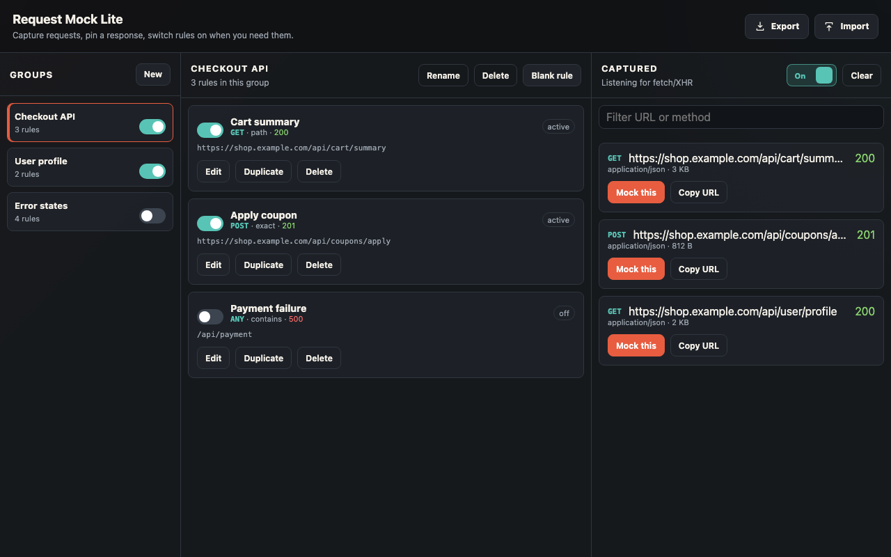
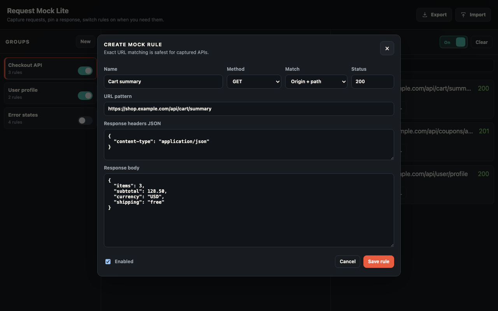
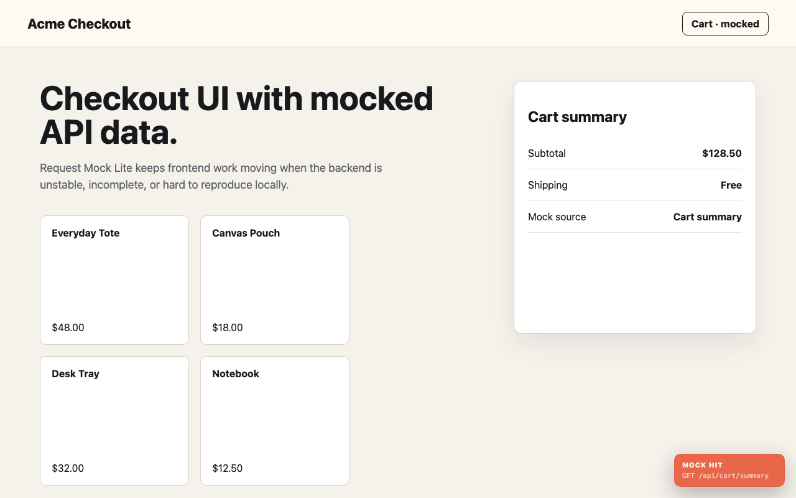

# Request Mock Lite

[](https://github.com/eijil/request-mock-lite/releases)
[](LICENSE)
[](https://github.com/eijil/request-mock-lite/releases)

**Request Mock Lite** is a lightweight Chrome DevTools extension for capturing
API requests and mocking `fetch` / `XMLHttpRequest` responses from the browser.

[中文文档](README.zh-CN.md) · [Download latest release](https://github.com/eijil/request-mock-lite/releases/latest)



## Why

Frontend work often depends on API states that are slow, unstable, unfinished,
or hard to reproduce. Request Mock Lite keeps that workflow local and fast:
capture a request, turn it into a rule, edit the response, and keep building.

## Highlights

- Capture HTTP(S) requests from the inspected tab.
- Create mock rules from captured requests.
- Mock response body, status code, and headers.
- Match by origin + path, exact URL, substring, or regex.
- Organize rules into groups.
- Enable or disable groups and individual rules.
- Import and export rules as JSON.

## Screenshots

| Rule editor | In-page mock badge |
| --- | --- |
|  |  |

## Installation

1. Download `request-mock-lite.zip` from the [latest release](https://github.com/eijil/request-mock-lite/releases/latest).
2. Unzip the package.
3. Open `chrome://extensions`.
4. Enable **Developer mode**.
5. Click **Load unpacked**.
6. Select the `request-mock-lite` folder.
7. Open DevTools and select the **Mock Lite** panel.

## Usage

1. Open the **Mock Lite** DevTools panel.
2. Refresh or use the page to collect requests.
3. Click **Mock this** on a captured request.
4. Edit the match rule, status, headers, or response body.
5. Save the rule and trigger the request again.

## Local Development

Clone the repository, then load the project folder as an unpacked Chrome
extension.

```bash
git clone https://github.com/eijil/request-mock-lite.git
cd request-mock-lite
```

Package a release zip:

```bash
./scripts/package.sh
```

## License

[MIT](LICENSE)
